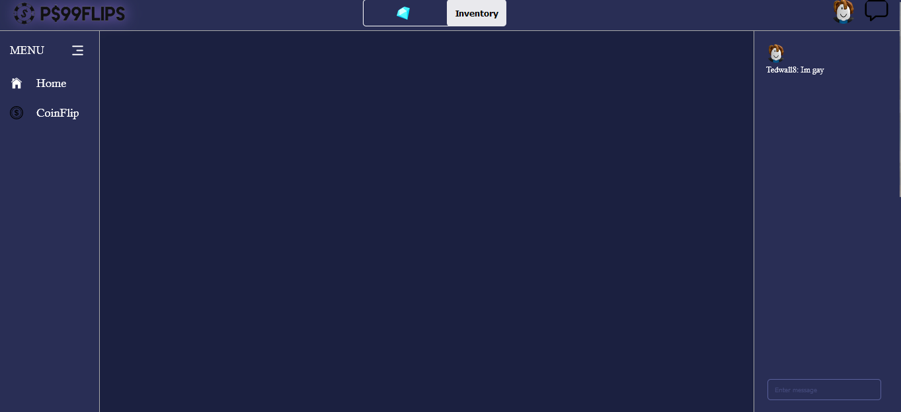

## Psx99Flips
`Simple website with a frontend for a gambling site and a backend to handle login/logout requests`

## Usage

`ask for username then generates random code and user then asks you to put code in description and checks if it matches, if so then it logs you in`

